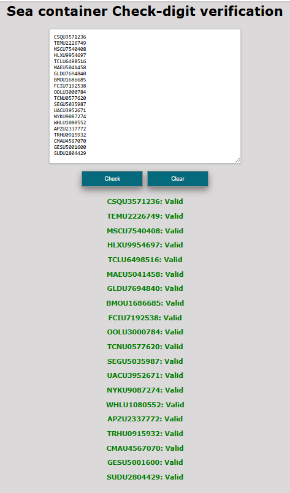
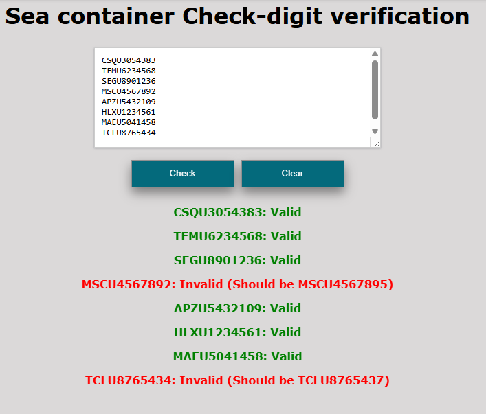

<p align="center">
  <a href="https://oldemarcrc.github.io/Sea-container-Check-Digit/" rel="noopener">
    
  </a>
</p>

<div align="center">

# Sea Container Check Digit Verifier

🔗 **[Ver Demo en Vivo](https://oldemarcrc.github.io/Sea-container-Check-Digit/)**

</div>

<p align="center">
  
  
  
</p>

---

## 📝 Description

This application verifies container numbers based on the **ISO 6346 (Modulus 11)** algorithm. It identifies whether a container number is valid by calculating the check digit and comparing it with the last digit provided.

- ✅ **Valid numbers** are highlighted in green.
- ❌ **Invalid numbers** are highlighted in red.

---

## ✨ Features

- 🔍 Real-time container number validation
- 📊 Batch processing support
- 🎨 Color-coded results (green/red)
- 📱 Responsive design
- ⚡ Fast validation using ISO 6346 algorithm

---

## 📸 Preview

<div align="center">
  
  
</div>

---

## 🧮 About ISO 6346

This application implements the [ISO 6346](https://en.wikipedia.org/wiki/ISO_6346) standard for shipping container identification. The standard defines a check digit calculation using the Modulus 11 algorithm to validate container numbers and prevent data entry errors in logistics operations.

---

## 📋 Prerequisites

- Node.js >= 18.0.0
- npm >= 9.0.0

---

## 🚀 Installation

To install and run the application locally, follow these steps:

1. Clone the repository:
   ```bash
   git clone https://github.com/OldemarCRC/Sea-container-Check-Digit.git
   ```

2. Navigate into the project directory:
   ```bash
   cd Sea-container-Check-Digit
   ```


3. Install dependencies:
   ```bash
   npm install
   ```

---

## 💻 Usage
1. Start the development server:
   ```bash
   npm run dev
   ```

2. Open in browser: Navigate to http://localhost:5173
3. Production Build: To create a production-ready bundle:
   ```bash
   npm run build
   ```
  
Note: This will generate a dist/ folder with the optimized files.

**Production Deployment:**
- The `dist/` folder contains static files (HTML, CSS, JS)
- Requires a web server (nginx, Apache, etc.) to serve the files
- Default dev server port: `5173`
- Production can use any port (commonly `80` or `8080`)

### Example Container Numbers
- ✅ Valid: `CSQU3054383`
- ❌ Invalid: `CSQU3054384`

---

## 📖 User Manual
For detailed instructions on how to use the app, please refer to the User [MANUAL_USER.md](MANUAL_USER.md).

---

## 🌐 Deployment

Live Demo: https://oldemarcrc.github.io/Sea-container-Check-Digit/

How to deploy changes
To update the live version, run the following command:
   ```bash
   npm run deploy
   ```

This script automates the build process with Vite and pushes the dist/ folder to the gh-pages branch.

---

## 🤝 Contributing

Contributions are welcome!

1. Fork the repository.

2. Create a feature branch (git checkout -b feature/AmazingFeature).

3. Commit your changes (git commit -m 'Add some AmazingFeature').

4. Push to the branch (git push origin feature/AmazingFeature).

5. Open a Pull Request.

---

## 👨‍💻 Author

**José Oldemar Chaves Urbina**
- GitHub: https://github.com/OldemarCRC
- LinkedIn: https://www.linkedin.com/in/oldemar-chaves/
- Website: https://oldemarcrc.github.io/my-portfolio/

---

## 📄 License

This project is licensed under the MIT License - see the [LICENSE.md](LICENSE.md) file for details.

---