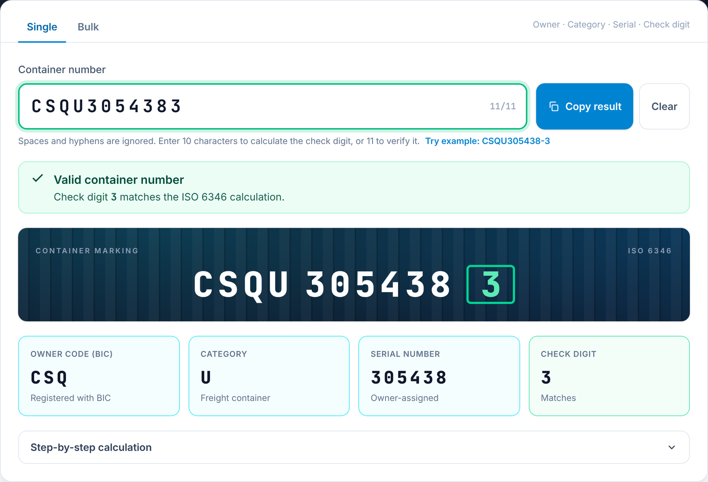
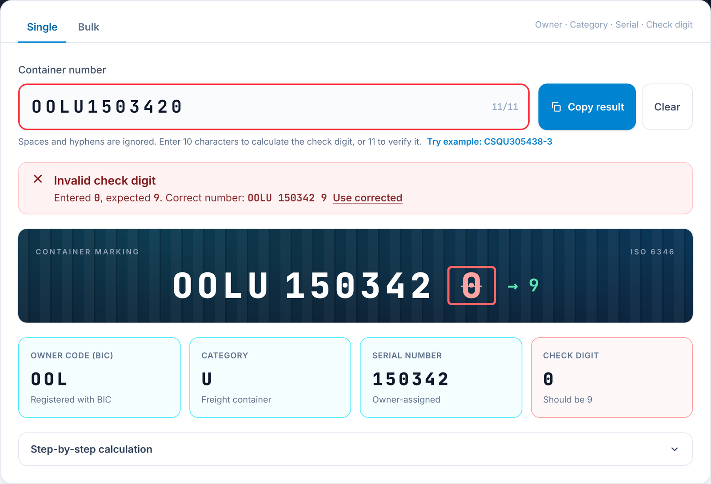
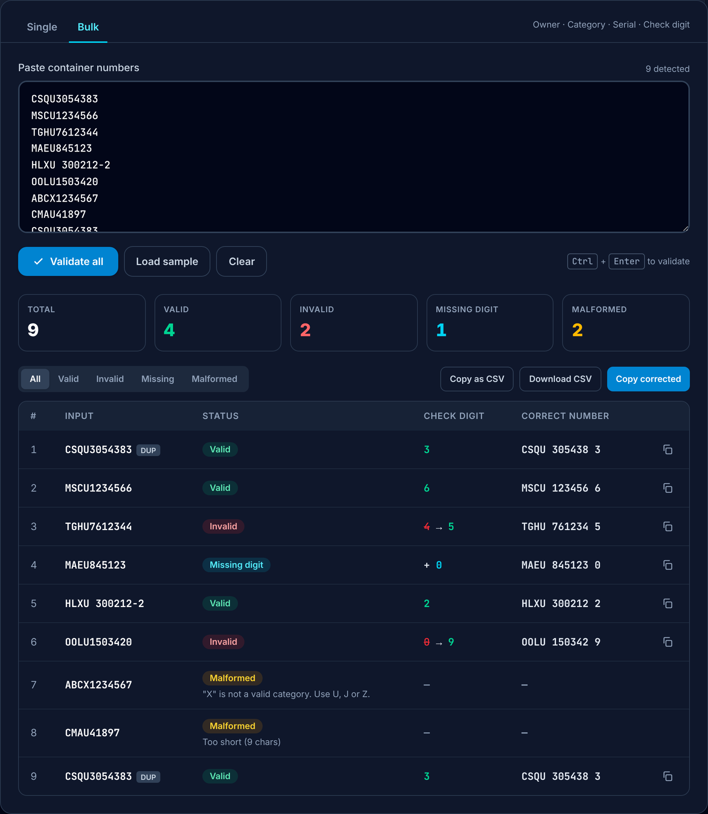
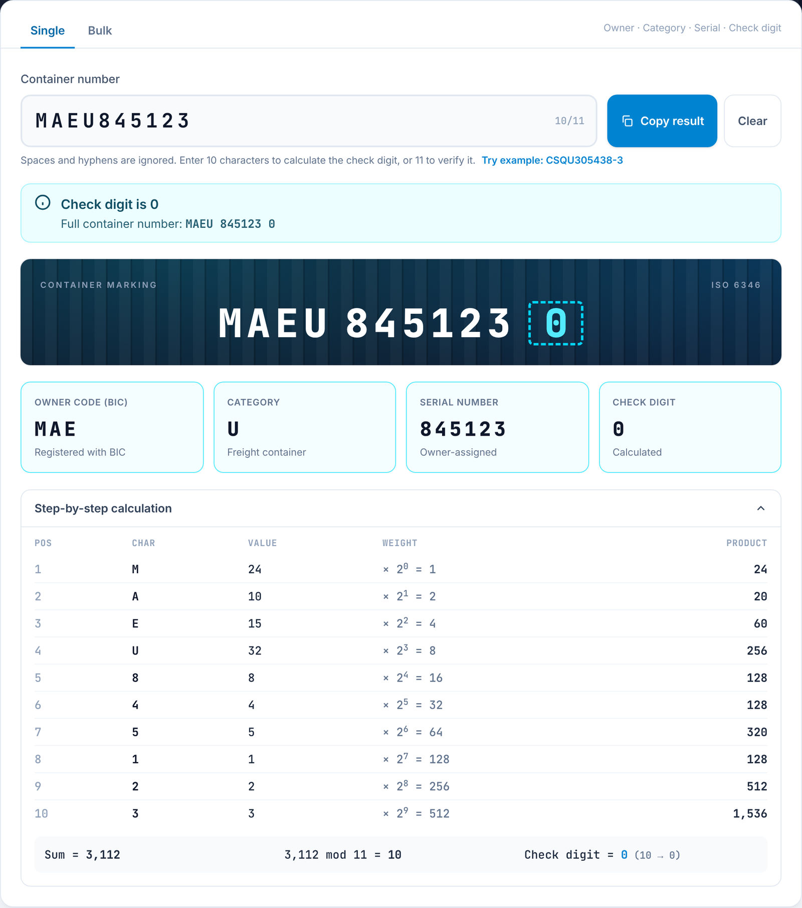

<p align="center">
  <a href="https://oldemarcrc.github.io/Sea-container-Check-Digit/" rel="noopener noreferrer">
    
  </a>
</p>

<div align="center">

# ContainerCheck: ISO 6346 Container Check Digit Validator

A fast, security-hardened web tool that calculates and verifies shipping container check digits. Check one number with live feedback, or a whole list at once.

🔗 **[Live demo](https://oldemarcrc.github.io/Sea-container-Check-Digit/)**


</div>

---

## 📸 Preview

<div align="center">
  
  
</div>
<div align="center">
  
  
</div>

---

## ✨ Features

**Single mode (live validation)**
- Converts input to uppercase as you type, and ignores spaces and hyphens (`CSQU 305438-3` works).
- With **10 characters** it calculates the check digit. With **11** it verifies it and shows green or red, plus the correct digit and a one-click **Use corrected**.
- A **breakdown panel** splits the code into Owner code (BIC), Category (`U` / `J` / `Z`), Serial number and Check digit. Each segment gets its own error message.
- A **container marking plate** shows the number the way it is painted on a container.
- **Step-by-step calculation**: value × 2ⁱ for each character, the sum, and mod 11.

**Bulk mode**
- Paste many numbers separated by new lines, commas, semicolons or tabs, then press **Validate all** or `Ctrl + Enter`.
- Summary counters (Valid, Invalid, Missing digit, Malformed), filter chips, and flags for duplicates.
- **Copy as CSV**, **Download CSV**, **Copy corrected**, plus a copy button on every row.

**General**
- Light and dark theme (follows your OS, with a manual toggle).
- Responsive and accessible (keyboard-navigable tabs, `aria-live` results) and installable as a PWA.
- Deep links: `?c=CSQU3054383` pre-fills Single mode and `#bulk` opens Bulk mode.
- **Private by design**: no backend, no tracking, nothing stored. Everything runs in your browser.

---

## 🧮 How the ISO 6346 check digit works

1. **Convert**: digits keep their value. Letters map to `A=10 … Z=38`, skipping multiples of 11 (11, 22, 33).
2. **Weight**: multiply each of the first 10 values by 2⁰ … 2⁹ and add the results.
3. **Modulo 11**: the check digit is `sum mod 11`. A remainder of 10 becomes `0`.

Example: `CSQU305438` gives a sum of 6,185 and 6,185 mod 11 = **3**, so the full number is `CSQU3054383`.

Category identifiers: `U` freight container, `J` detachable freight equipment, `Z` trailer or chassis. More on [ISO 6346](https://en.wikipedia.org/wiki/ISO_6346).

### Example numbers
| Input | Result |
|---|---|
| `CSQU3054383` | ✅ Valid |
| `CSQU3054384` | ❌ Invalid. Expected `3` |
| `MAEU845123` | ➕ Missing digit. Becomes `MAEU8451230` |
| `ABCX1234567` | ⚠️ Malformed. `X` is not a valid category |

---

## 🛡️ Security

The app is hardened to OWASP client-side guidelines and is tested against XSS payloads, framing and resource tampering:

- **No HTML string sinks.** The UI is built only with `createElement` and text nodes, and the browser enforces this through **Trusted Types**.
- **Strict CSP**: `default-src 'none'`, scripts, styles and fonts only from `'self'`, no `unsafe-inline` or `unsafe-eval`.
- **Zero third-party resources.** Tailwind is compiled at build time and fonts are self-hosted. Every script and stylesheet ships with **SRI** (`sha384`).
- Anti-clickjacking, CSV formula-injection protection, input limits, and **no storage** (no localStorage, sessionStorage or cookies).
- No runtime dependencies. `npm audit` reports **0 vulnerabilities**, and CI blocks deploys if a high-severity advisory appears.

The full control matrix and hosting notes are in **[SECURITY.md](SECURITY.md)**.

---

## 🧰 Tech stack

| Layer | Choice |
|---|---|
| UI | HTML5 + vanilla JavaScript (ES modules, no framework) |
| Styling | Tailwind CSS 4 (compiled), Inter + JetBrains Mono (self-hosted) |
| Build | Vite 6 · vite-plugin-pwa · custom SRI plugin |
| Hosting | GitHub Pages via GitHub Actions |

### Project structure
```
├── index.html               # Markup + CSP meta (no inline scripts or styles)
├── src/
│   ├── main.js              # ISO 6346 logic, safe DOM rendering, single + bulk modes
│   └── styles.css           # Tailwind entry, fonts, anti-framing rule
├── public/
│   ├── security-init.js     # Anti-clickjacking + initial theme (runs before paint)
│   └── *.png / favicon.ico  # Icons
├── vite.config.js           # Tailwind, PWA, SRI plugin, dev-only CSP relaxation
├── .github/workflows/
│   └── deploy.yml           # Build, audit and deploy to GitHub Pages
├── SECURITY.md
└── MANUAL_USER.md
```

---

## 🚀 Getting started

**Prerequisites:** Node.js ≥ 18 and npm ≥ 9.

```bash
git clone https://github.com/OldemarCRC/Sea-container-Check-Digit.git
cd Sea-container-Check-Digit
npm install
npm run dev        # http://localhost:5173/Sea-container-Check-Digit/
```

| Script | Description |
|---|---|
| `npm run dev` | Dev server with hot reload (the CSP meta tag is removed in dev only) |
| `npm run build` | Production build to `dist/` (CSP + SRI applied) |
| `npm run preview` | Serves the production build locally. Use it for security testing |
| `npm run audit:prod` | Audits production dependencies |

---

## 🌐 Deployment

Deployment is automatic. Every push to `main` runs [`.github/workflows/deploy.yml`](.github/workflows/deploy.yml), which:

1. installs the exact lockfile versions (`npm ci --ignore-scripts`),
2. fails if `npm audit` finds a high or critical issue,
3. builds and publishes `dist/` to GitHub Pages.

To redeploy without changes, go to **Actions → Deploy to GitHub Pages → Run workflow**.
One-time setup: **Settings → Pages → Source → GitHub Actions**.

---

## 📖 User manual

For step-by-step usage instructions, see **[MANUAL_USER.md](MANUAL_USER.md)**.

---

## 🤝 Contributing

1. Fork the repository.
2. Create a feature branch: `git checkout -b feature/amazing-feature`.
3. Commit your changes: `git commit -m "Add amazing feature"`.
4. Push the branch: `git push origin feature/amazing-feature`.
5. Open a Pull Request.

Please keep the security rules: no `innerHTML` or inline scripts, and no third-party CDNs.

---

## 👨‍💻 Author

**José Oldemar Chaves Urbina**
- GitHub: [@OldemarCRC](https://github.com/OldemarCRC)
- LinkedIn: [oldemar-chaves](https://www.linkedin.com/in/oldemar-chaves/)
- Portfolio: [oldemarcrc.github.io/my-portfolio](https://oldemarcrc.github.io/my-portfolio/)

---

## 📄 License

MIT. See [LICENSE.md](LICENSE.md).
